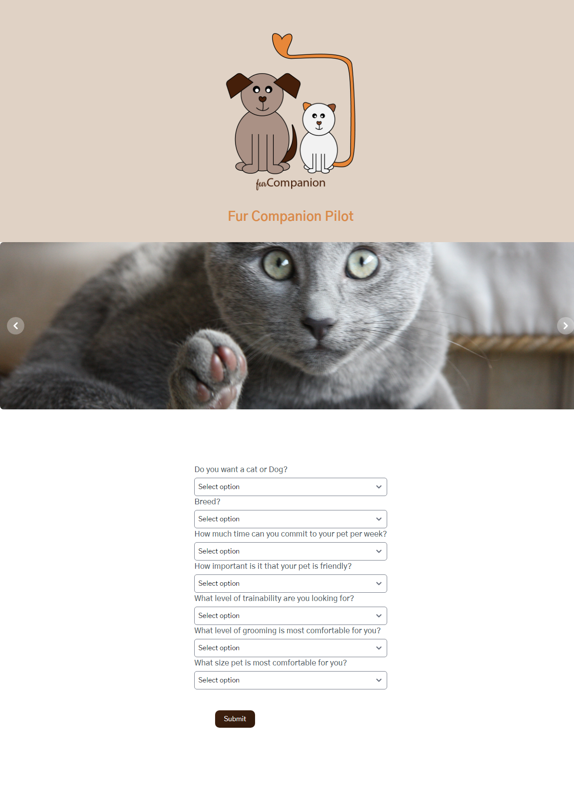
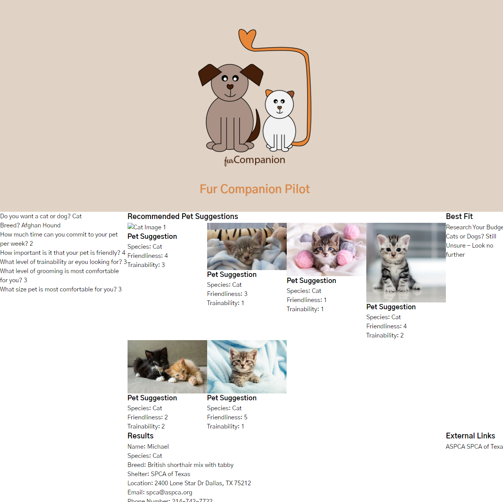
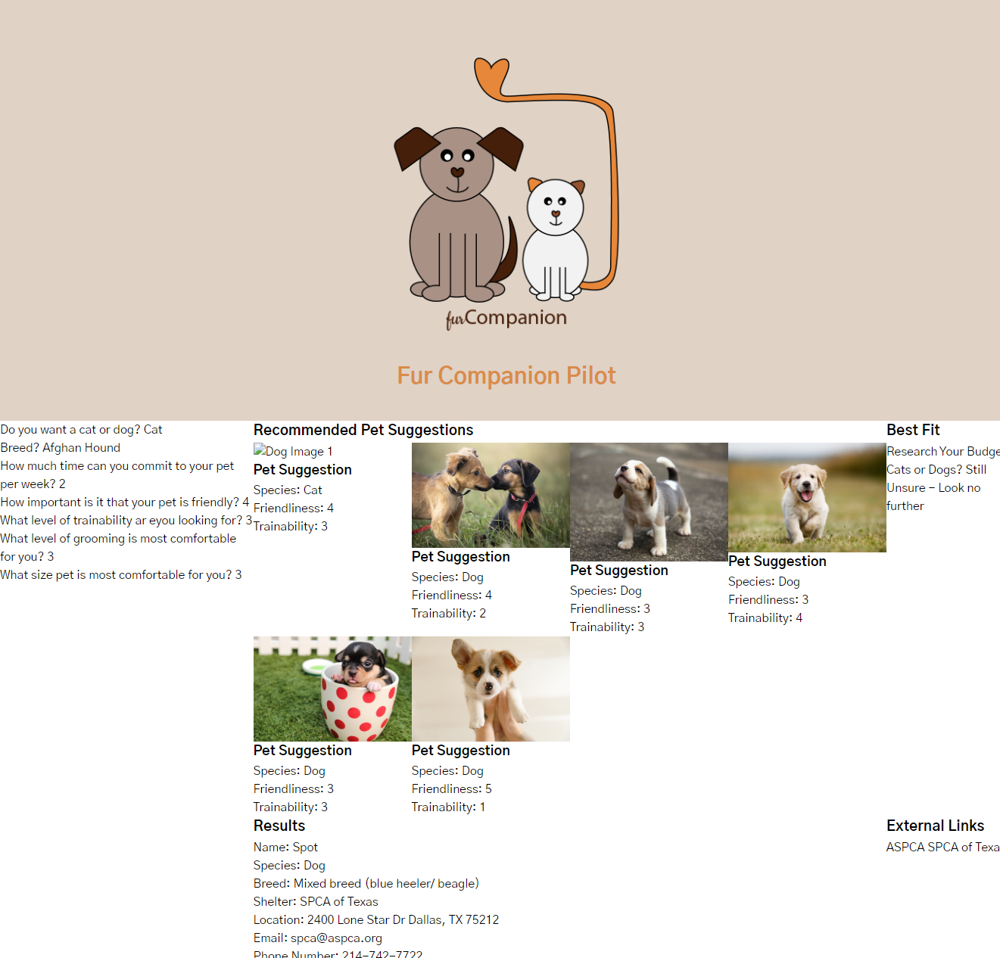

# fur-companion-pilot

## User Story

AS A hopeful future owner of a rescue pet,
I WANT to explore information and needs of different species and breeds,
SO THAT I can empower myself with knowledge to make a confident, no regret decision that ensures an optimal match between myself and my fur companion.

## Description

Provide a short description explaining the what, why, and how of your project. Use the following questions as a guide:

- What was your motivation? The motivation of this project is to promote adoptions of cats and dogs.
- Why did you build this project? (Note: the answer is not "Because it was a homework assignment.") We built this project to understand the agile method in a group setting.
- What problem does it solve? The problem to solve in this project is to guide the user in what would pet would be best for them to adopt.
- What did you learn? We learned how to user tailwind as our new css framework, incorporated two new APIs, and worked on question logic and local storage.

Fur Companion Pilot is an innovative application designed to aid in the pet selection process. Your Fur Companion Pilot will provide you with insight to be make the process of researching if and which fur companion is right for you. By offering a owner oriented approach to determining the potential breeds that have been identified as an appropriate match based on your needs, the needs of different species/breeds and your lifestyle.

## Table of Contents (Optional)

If your README is long, add a table of contents to make it easy for users to find what they need.

- [Installation](#installation)
- [Usage](#usage)
- [Credits](#credits)
- [License](#license)

## Installation

What are the steps required to install your project? Provide a step-by-step description of how to get the development environment running.

## Usage

Provide instructions and examples for use. Include screenshots as needed.

To add a screenshot, create an `assets/images` folder in your repository and upload your screenshot to it. Then, using the relative filepath, add it to your README using the following syntax:
[deployed](https://0clark30.github.io/fur-companion-pilot-ac/)
[github](https://github.com/0Clark30/fur-companion-pilot-ac)

Deployment link - https://thomasvtran.github.io/fur-companion-pilot/   

## Credits

Tutorial for submit forms answers to local storage:
https://stackoverflow.com/questions/10425482/save-data-to-localstorage-when-form-is-submitted
https://stackoverflow.com/questions/40711887/handling-form-submission-with-javascript-how-to-give-user-another-chance
https://developer.mozilla.org/en-US/docs/Web/HTML/Element/option

Here are the collaborators:
- https://github.com/ThomasVTran -- Thomas
- https://github.com/0Clark30 -- Austin
- https://github.com/harleysherman -- Harley

## License

There is no license at this time.

---

## Badges

There are no badges at this time.

## Features

If your project has a lot of features, list them here.

## How to Contribute

There are no contributions at this time.

## Tests

Here are some test cases below:
- If user maxes out local storage, it should let the user know.
- If the user breaks out the dropdown selection for any reason, an error will display.
- The site is also responsive to most platforms.

